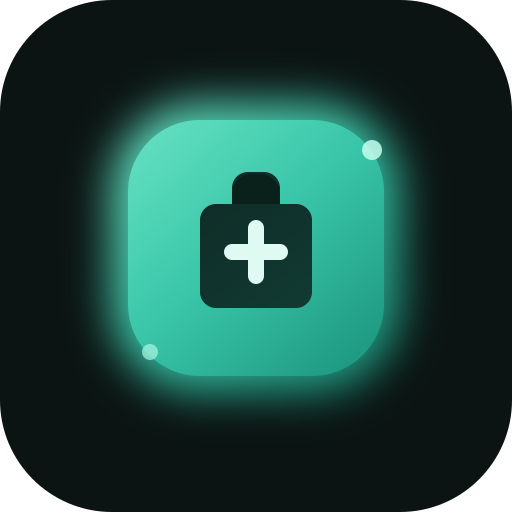

<p align="center">
  
</p>

<h1 align="center">MedScanAI</h1>

<p align="center">
  <strong>Offline Medicine Intelligence Platform</strong><br />
  <em>Scan. Search. Know — Even Without the Internet.</em>
</p>

<p align="center">
  
  
  
  
  
  
  
  
</p>

<p align="center">
  <a href="https://fayasx-med-scan-ai.hf.space" target="_blank">
    
  </a>
  <a href="https://github.com/MohammadFayasKhan/MedScanAI" target="_blank">
    
  </a>
</p>

---

## 🌐 Live Demo

> Try MedScanAI right now — no install required.

[](https://fayasx-med-scan-ai.hf.space)

| Resource | Link |
|---|---|
| 🚀 Live Deployment | [fayasx-med-scan-ai.hf.space](https://fayasx-med-scan-ai.hf.space) |
| 💻 Source Code | [github.com/MohammadFayasKhan/MedScanAI](https://github.com/MohammadFayasKhan/MedScanAI) |

---

## 📌 Overview

**MedScanAI** is a fully offline, installable Progressive Web App (PWA) for fast, private pharmaceutical data access. It combines a browser-side SQLite runtime, a multi-stage OCR pipeline, confidence-based medicine matching, and a context-aware clinical assistant — all running entirely in the browser without any backend server.

After the first load, MedScanAI works completely offline. Search queries, medicine detail views, scan history, OCR candidate confirmations, and AI chatbot context are all powered by local assets and local storage. No remote API calls. No data leaves your device.

---

## 💡 Why MedScanAI?

Most medicine lookup tools assume a stable internet connection, remote APIs, and perfect user input. MedScanAI takes a fundamentally different approach:

| Problem | MedScanAI's Answer |
|---|---|
| Internet dependency | Fully offline after first load |
| Exact-spelling requirement | OCR handles blurry, partial, and noisy text |
| Silent wrong matches | Confidence scoring + user confirmation flow |
| Privacy concerns | Zero data transmission — all processing is local |
| Complicated installs | One-click PWA install from any browser |

---

## ✨ Key Features

### 🔍 Offline-First Medicine Search
- Loads a merged pharmaceutical database from a local SQLite file via `sql.js`
- Caches the database in IndexedDB so it persists across sessions
- Full-text search across brand names, generic names, compositions, and dosage forms
- Works completely offline after the initial load

### 📷 OCR-Powered Package Scanning
- Capture medicine packaging with your camera or upload an image
- Multi-step image preprocessing pipeline for improved text extraction
- Tesseract.js-powered OCR with structured field extraction
- Extracts brand name, composition, strength, and dosage form from real-world packaging

### 🧠 Confidence-Based Matching Engine
- Scores medicine candidates using weighted multi-signal similarity
- Combines Jaro-Winkler and Levenshtein-based string comparisons
- Automatically navigates to a strong match or presents ranked candidates for user confirmation
- Avoids silent wrong selections from noisy or partial OCR input

### 💬 Context-Aware Medicine Assistant
- Built-in clinical AI assistant with session memory
- Responds to questions about the currently viewed medicine
- Follows a structured missing-data protocol for incomplete queries
- Provides empathetic, safety-first responses with clear medical disclaimers
- Supports 30+ granular clinical intent categories

### 📲 Installable PWA
- Install on desktop or mobile from any modern browser
- Service worker caches the application shell
- IndexedDB retains the database between sessions
- App shell loads instantly, even offline

---

## 🏗️ Architecture

### Data Pipeline

```text
CSV Sources
  ┣━ medscan_az_dataset.csv
  ┣━ medscan_details_data.csv
  ┗━ medscan_raw_data.csv
        │
        ▼
  Node.js Build Script (scripts/build-database.js)
        │
        ▼
  public/db/medscan.db  (SQLite binary)
        │
        ▼
  Browser Fetch (sql.js + sql-wasm.wasm)
        │
        ▼
  IndexedDB Cache (localforage)
        │
        ▼
  Search · Detail Views · OCR Matching · Chatbot Context
```

### OCR Pipeline

```text
Image Capture / Upload
        │
        ▼
  Image Preprocessing (contrast, sharpening, noise reduction)
        │
        ▼
  Tesseract.js OCR Engine
        │
        ▼
  OCR Text Cleanup (punctuation normalization, noise stripping)
        │
        ▼
  Structured Field Extraction (brand · composition · strength · form)
        │
        ▼
  Weighted Similarity Scoring against Medicine Candidates
        │
        ▼
  Auto-Match (high confidence) ──or── Candidate List (low confidence)
```

---

## 🗂️ Project Structure

```text
medscan-web/
├── public/
│   ├── db/
│   │   └── medscan.db              # Compiled SQLite medicine database
│   ├── medscanai-logo.svg          # App logo
│   ├── sql-wasm.wasm               # sql.js WebAssembly runtime
│   └── sql-wasm-browser.wasm       # sql.js browser WebAssembly variant
├── scripts/
│   └── build-database.js           # Node.js CSV → SQLite build script
├── src/
│   ├── ai/                         # Clinical AI assistant engine & prompts
│   ├── components/                 # Reusable UI components
│   ├── context/                    # React context providers
│   ├── db/                         # sql.js database loader & query helpers
│   ├── hooks/                      # Custom React hooks
│   ├── pages/                      # Route-level page components
│   ├── search/                     # Search logic & ranking
│   ├── services/                   # OCR pipeline & image preprocessing
│   ├── store/                      # Zustand global state
│   ├── types/                      # TypeScript type definitions
│   ├── utils/                      # Shared utility functions
│   └── workers/                    # Web Workers for background processing
├── Dockerfile                      # Production Docker image
├── nginx.conf                      # Nginx static file server config
├── package.json
├── vite.config.ts
└── README.md
```

---

## 🛠️ Tech Stack

| Layer | Technology | Purpose |
|---|---|---|
| Frontend Framework | React 18 + TypeScript | Component-driven UI |
| Build Tool | Vite | Fast dev server & production bundler |
| Styling | Tailwind CSS + Framer Motion | Design system & animations |
| In-Browser Database | `sql.js` | SQLite runtime via WebAssembly |
| Build-Time Database | `better-sqlite3` + Node.js | CSV → SQLite compilation |
| Local Persistence | `localforage` (IndexedDB) | Offline database cache |
| OCR Engine | `tesseract.js` | Image-to-text recognition |
| String Matching | Jaro-Winkler / Levenshtein | Fuzzy medicine matching |
| Global State | Zustand + React Context | Session & history management |
| PWA | `vite-plugin-pwa` + Workbox | Service worker & offline support |
| Containerization | Docker + Nginx | Production deployment |

---

## 🚀 Getting Started

### Prerequisites

- Node.js 18+
- npm 9+

### Installation & Development

```bash
# 1. Clone the repository
git clone https://github.com/MohammadFayasKhan/MedScanAI.git
cd MedScanAI

# 2. Install dependencies
npm install

# 3. Build the SQLite database from source CSVs
npm run build:db

# 4. Start the development server
npm run dev
```

Development server: **http://127.0.0.1:5173/**

---

## ⚙️ NPM Scripts

| Command | Purpose |
|---|---|
| `npm run dev` | Start Vite development server |
| `npm run build:db` | Compile CSV sources into `public/db/medscan.db` |
| `npm run build` | Full production build (TypeScript check + Vite bundle) |
| `npm run preview` | Serve the production build locally |
| `npm run lint` | Run ESLint across all source files |
| `npm run typecheck` | Run TypeScript type checking |

---

## 📦 Production Build

```bash
npm run lint -- --max-warnings=0
npm run typecheck
npm run build
npm run preview
```

Preview server: **http://127.0.0.1:4173/**

---

## 📴 Offline Deployment Options

MedScanAI is designed around offline use. Here are the recommended deployment paths ranked by simplicity:

### ✅ Option 1 — Local PWA Install (Recommended)

Best for: personal laptop / desktop use

```bash
npm run build
npm run preview
```

1. Open **http://127.0.0.1:4173/** in Chrome or Edge
2. Accept the browser's install prompt
3. Let the app fully load once (caches service worker + IndexedDB database)
4. Close the tab — the installed app now works offline permanently

---

### Option 2 — Static Preview Server

Best for: quick local testing without Docker

```bash
npm run build
npm run preview -- --host 127.0.0.1 --port 4173
```

---

### Option 3 — Docker + Nginx

Best for: stable self-hosting, kiosk deployments, portfolio demos

```bash
docker build -t medscanai .
docker run -p 8080:80 medscanai
```

Open: **http://localhost:8080/**

Benefits:
- Consistent runtime across machines
- No Node.js required at runtime
- Ideal for demos, shared team access, or kiosk setups

---

### Option 4 — LAN Deployment

Best for: accessing from a phone or tablet on the same Wi-Fi network

```bash
npm run dev -- --host 0.0.0.0
# or
npm run preview -- --host 0.0.0.0
```

Access from any device on the same network using your machine's local IP address.

> **Note:** Each device needs one successful online load to cache the app locally before it can work offline.

---

### Option 5 — Desktop App Wrapper (Future Path)

Best for: shipping a self-contained native-like desktop app

The current architecture is a strong candidate for wrapping with:

- [Tauri](https://tauri.app/) — lightweight Rust-based desktop wrapper
- [Electron](https://www.electronjs.org/) — established cross-platform desktop runtime

Both allow the app to launch like a native application with the local database bundled directly.

---

## 🗃️ Runtime Assets

These files are required at runtime and are included in the repository:

| File | Description |
|---|---|
| `public/db/medscan.db` | Compiled SQLite medicine database |
| `public/sql-wasm.wasm` | sql.js WebAssembly binary |
| `public/sql-wasm-browser.wasm` | sql.js browser WebAssembly variant |
| `public/medscanai-logo.svg` | Application logo |

---

## ⚕️ Medical Disclaimer

> MedScanAI is intended for **educational and informational purposes only**.
> It does **not** replace professional medical advice, clinical diagnosis, or treatment decisions.
> Always consult a licensed healthcare professional before acting on any pharmaceutical information.

---

## 👤 Author

**Mohammad Fayas Khan**

[](https://github.com/MohammadFayasKhan)

---

## 📄 License

This project is intended for educational and portfolio use.

---

<p align="center">
  <em>Built with care for offline-first healthcare accessibility.</em>
</p>
